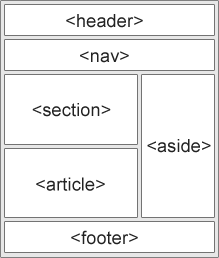

# HTML

## 주요 태그 정리

### 태그 분류

1. Block Element vs Inline Element (css display 속성과 연관)

   - Block Element

     - 언제나 줄바꿈

       - Block Element 종류

         ```
         <address><article><aside><blockquote><canvas>
         <dd><div><dl><dt><fieldset><figcaption><figure>
         <footer><form><h1>-<h6><header><hr><li><main>
         <nav><noscript><ol><p><pre><section><table><tfoot><ul><video>
         ```

   - Inline Element

     - 공간이 충분하다면 줄바꿈을 하지 않고 옆에 표시

       - Inline Element 종류

         ```
         <a><abbr><acronym><b><bdo><big><br>
         <button><cite><code><dfn><em><i>
         <input><kbd><label><map><object><output>
         <q><samp><script><select><small><span><strong>
         <sub><sup><textarea><time><tt>< var >
         ```

2. Box Element vs Item Element

   - Box Element

     - 자체로는 아무것도 표시되지 않지만, 레이아웃을 나누고 다른 태그를 담는 태그

       - Box Element 종류

         ```
         <header><section><footer><article><nav><div><span><form> 등등...
         ```

   - Item Element

     - 특정 기능을 수행하는 태그

       - Item Element 종류

         ```
         <a><button><input><video> 등등...
         ```

### 시멘틱 태그



- 태그에 의미를 부여해서 브라우저와 개발자가 의미를 쉽게 알 수 있도록 돕는 태그.
- 기존에는 대부분 div, span에 class, id 속성을 이용해 표현했음.
