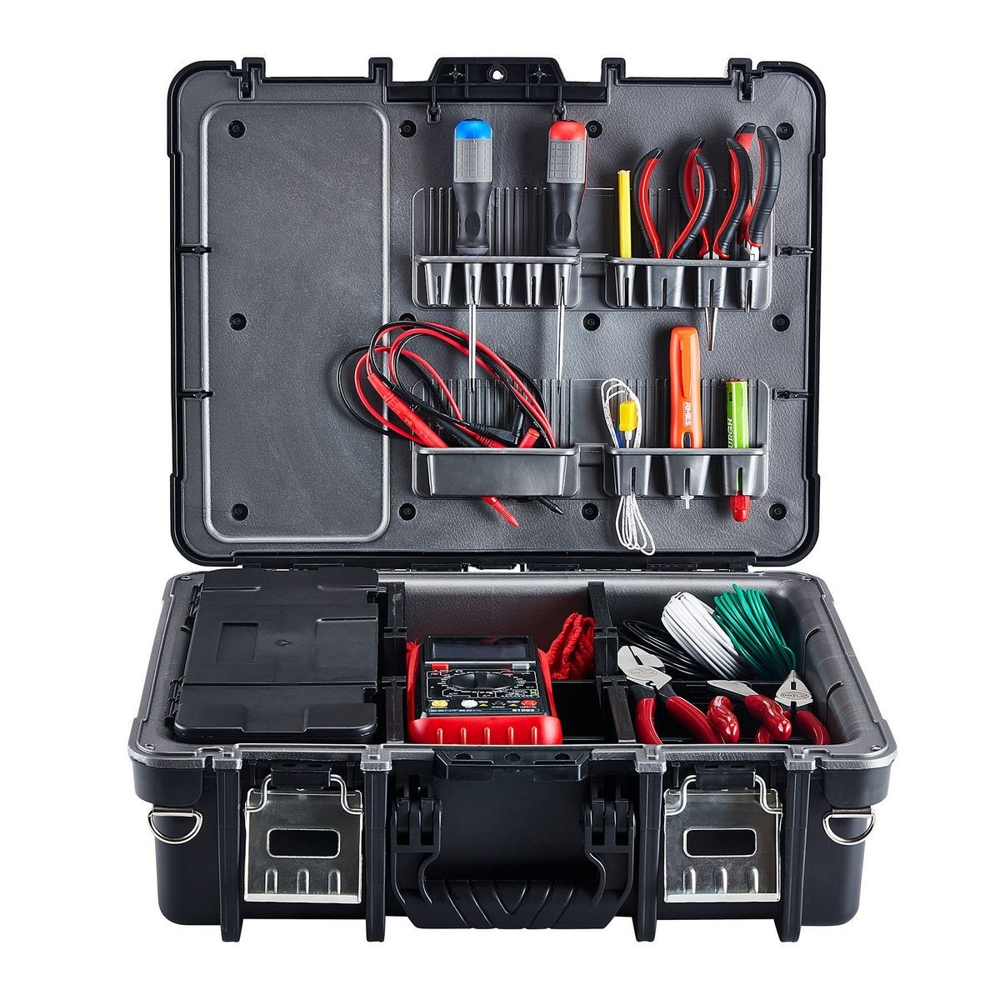

# Node & Express

## Rest API 이해

라이브러리, 프레임워크, API.. 이 단어들은 개발을 하다보면 자주 보게되는 단어들이다.

위 세개 개념 모두 사실 거의 비슷한 의미를 가지고 있습니다.

개발에 필요한 미리 구현된 기능을 일컫는 말이다.

불필요한 반복은 줄이고 복잡한 기능도 쉽게 사용할 수 있는 것이다.

**프레임워크**란, 마치 공구상자 같은 개념이다.

공구상자 내부에는 다양한 도구가 있다.

망치, 장도리, 니퍼, 스페너 등.. 수많은 도구가 존재하고 심지어 그 도구를 어떻게 사용해야하는지에 대한 가이드라인도 존재하는 것이 공구상자이다.

마찬가지로 프레임워크는 내부에 수많은 기능이 존재하고 소스코드를 어떻게 작성해서 사용해야하는지에 대한 가이드라인까지 나와있는 것이다.

우리는 노드로 API 서버 개발을 쉽게 하기 위해 express 라는 프레임워크를 사용할 것이다.

**라이브러리**란, 공구상자 내부에 있는 도구 1개를 의미한다.

망치 하나. 니퍼 하나. 이런식으로 각각의 단위 기능을 하는 것이 바로 라이브러리라고 이해하면 된다.

실상 개발자들이 거의 비슷한 의미로 이 두 단어를 사용하고 있고 핵심은 `미리 구현된 외부 기능` 이라는 점이다.

`이렇듯 우리는 미리 개발해둔 기능을 가져와서 손쉽게 개발할 수 있다.`

애플리케이션을 개발하는데 사용하는 인터페이스이다.

이것이 바로 API라는 개념이다.

라이브러리, 프레임워크 이 모든 것은 API라는 범주에 있다고 할 수 있다.

실상 우리가 개발할 때 만들었던 간단한 함수도 API라고 말할 수 있는 것이다.

### API (Application Programming Interface)

여기서 Inter + face라는 단어에 집중해보자.

예를 들어,

A국가의 대통령이 있고. 미사일이 있다고 가정을 하자.

대통령은 미사일을 발사하기 위해 특수한 열쇠를 사용하면 된다고 한다.

열쇠를 돌리면 미사일이 발사된다.

열쇠를 돌린 후엔 여러가지 보안이나 유효성 검증을 통해 발사 여부를 확인하고 미사일 발사 가능여부를 확인하는 등.. 여러가지 기술적인 기능이 복잡하게 연결되어 있을 것이다.

대통령이 알고 있는 것은 오로지 `열쇠를 돌리면 미사일이 발사된다` 이다.

대통령이 여러가지 기술적인 생각을 할 필요는 없다.

이때, 열쇠를 대통령과 미사일 사이의 `인터페이스`라고 한다.

마찬가지로 개발을 할 때 이 열쇠같은 것이 API이다.

회원가입, 상품 목록 조회, 로그인 기능 등..

클라이언트는 서버에 구현된 복잡한 로직을 이해할 필요 없이 회원가입을 원하면

`HTTP POST /user` 이런식으로 서버에게 요청하며 회원 데이터만 넘기면 되는 것이다.

클라이언트는 서버로부터 다양한 기능을 요청합니다.

요청을 주고받을 때는 HTTP 프로토콜을 사용하며

요청 형태에 따라 GET, POST, PATCH, PUT, DELETE 등 여러 HTTP 메서드를 사용한다.

사실 회원가입은 `HTTP GET /dummy` 로 해도 서버에서 이런식으로 기능을 만들어 놓기만 했다면 문제가 없다.

하지만 문제는 표준이다.

회원가입 API인 것은 맞지만 만드는 사람마다 인터페이스의 생김새가 뒤죽박죽이면 소통이 어려울 것이다.

API를 어떻게 만들 것인가에 대한 표준이 Rest API 방식이다.

#### Restful

|HTTP 메서드|의미|URI|해석|비고|
|---|---|---|---|---|
|GET|조회하다.|/users?age=20|20살 유저를 조회하겠다.|쿼리스트링, 경로변수|
|POST|생성하다.|/user|유저를 생성하겠다. (회원가입)|패킷 바디|
|PATCH|일부 수정하다.|/user|유저를 수정하겠다. (회원정보 수정)|패킷 바디|
|PUT|전체 수정하다.|/user|유저를 수정하겠다. (회원정보 수정)|패킷 바디|
|DELETE|삭제하다.|/user/1|유저를 삭제하겠다. (회원탈퇴)|쿼리스트링, 경로변수|