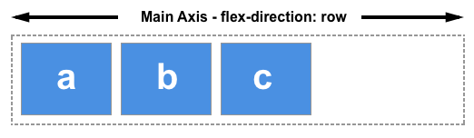
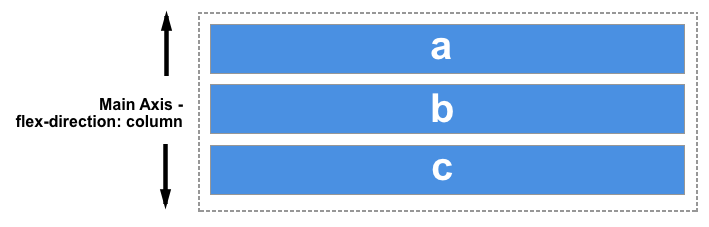
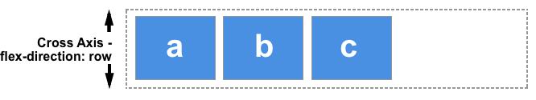
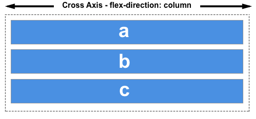
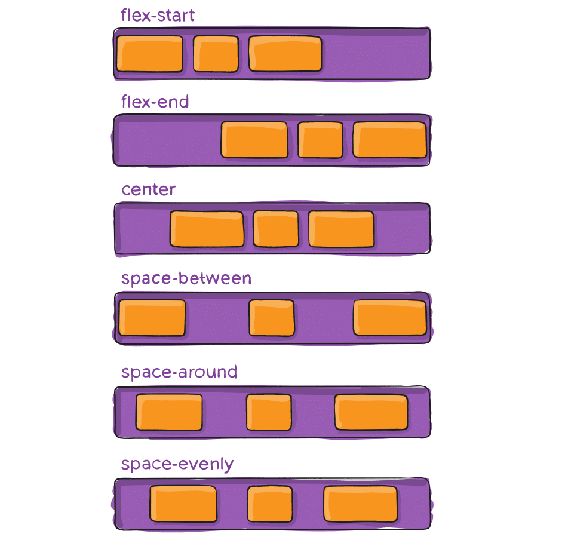
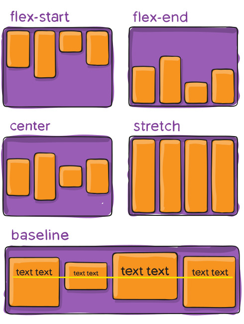

# CSS

## CSS Layout - Flexbox1

flex box를 사용한 레이아웃은 반응형 웹 제작을 더욱 간편하게 해주는 도구 중 하나이다.

[flexbox의 기본 개념](https://developer.mozilla.org/ko/docs/Web/CSS/Guides/Flexible_box_layout/Basic_concepts)

컨테이너와 아이템에 적용되는 속성이 따로 있다.

#### 컨테이너

- flex-direction : 주축방향 설정
- justify-content : 주축방향 정렬 방식
- align-items : 교차축방향 정렬 방식
- flex-wrap : 줄바꿈 설정
- align-content : 교차축 정렬 방식 (2줄 이상)

#### 아이템

- flex-basis : 기본 너비 비율
- align-self : 교차축 정렬 방식
- flex-grow : 증가 너비 비율
- flex-shrink : 감소 너비 비율

### 컨테이너 관련 속성

#### flex-direction

플렉스 박스를 다루기 위해서는 주축과 교차축이라는 두 개의 축에 대해 알아야 함.

<aside>

💡 주축: flex-dretion 속성을 사용하여 지정

💡 교차축: 주축에 수직인 축

</aside>

**주축(Main Axis)**

이는 flex-diretion에 의해 정의되며 총 4개의 값을 가질 수 있습니다.

- row(순방향)
- row-reverse(역방향)
- column(순방향)
- column-reverse(역방향)

**교차축 (Cross Axis)**

- 주축에 수직인 방향
- 만약 flex direction이 row라면 교차축은 열방향

### justify-content

이 속성은 **주축 방향 정렬 방식을 설정**함.

#### 속성값

- stretch : 기본 설정, 플렉스 요소의 높이가 플렉스 컨테이너의 높이와 같게 변경된 뒤 연이어 배치됨.
- flex-start : 플렉스 요소는 플렉스 컨테이너의 위쪽에 배치됨.
- flex-end : 플렉스 요소는 플렉스 컨테이너의 아래쪽에 배치됨.
- center : 플렉스 요소는 플렉스 컨테이너의 가운데에 배치됨.
- baseline : 플렉스 요소는 플렉스 컨테이너의 기준선(baseline)에 배치됨.

### align-items

이 속성은 **교차축 방향 정렬 방식을 설정**함.

#### 속성값

- stretch : 기본 설정, 플렉스 요소의 높이가 플렉스 컨테이너의 높이와 같게 변경된 뒤 연이어 배치됨.
- flex-start : 플렉스 요소는 플렉스 컨테이너의 위쪽에 배치됨.
- flex-end : 플렉스 요소는 플렉스 컨테이너의 아래쪽에 배치됨.
- center : 플렉스 요소는 플렉스 컨테이너의 가운데에 배치됨.
- baseline : 플렉스 요소는 플렉스 컨테이너의 기준선(baseline)에 배치됨.

### flex-wrap

플렉스 라인에 여유공간이 없을 때 (화면이 작을 때) 플렉스 요소를 다음줄로 넘길지를 설정

#### 속성값

- nowrap : 기본 설정, 플렉스 요소가 다음 줄로 넘어가지 않음. 대신에 플렉스 요소의 너비를 줄여서 한 줄에 모두 배치시킴.
- wrap : 플렉스 요소가 여유 공간이 없으면 다음 줄로 넘어가서 배치됨.
- wrap-reverse : 플렉스 요소가 여유 공간이 없으면 다음 줄로 넘어가서 배치됨. 단, 아래쪽이 아닌 위쪽으로 넘어감.

### align-content

여러 줄의 플렉스 라인에 대한 교차축 정렬 방식 설정

#### 속성값

- stretch
- flex-start
- flex-end
- center
- space-between
- space-around
- space-evenly
