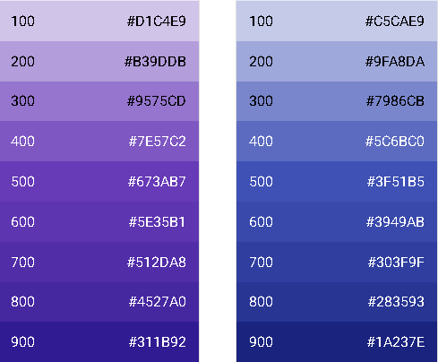

# CSS

## CSS 사이즈 단위

### px


- 디바이스의 화면은 수많은 픽셀로 구성되어 있음.
- 화면의 최소 단위, 한칸 한칸이 바로 픽셀이라는 단위이다.

### rem

- 문서의 최상위 요소(html 태그)에 정의되어 있는 font-size를 기준으로 크기를 정함.
- 일반적으로 브라우저엔 기본적으로 16px로 설정되어 있는데, 우리는 이를 10px로 변환하여 계산하기 쉽게 사용할 수 있음.

### em

- 부모요소의 글꼴 크기를 의미함.
- 중첩되어 있는 태그에 em 단위를 사용하면 중첩 단계가 깊어질 수록 계산이 어려워지는 단점이 있음.

### %

- 백분율 단위로 지정된 사이즈를 기반하여 상대적인 크기를 가지게 됨.
- em과 같다고 보아도 좋지만 일반적으로 em은 폰트 사이즈를 조절할때 사용하는 단위이고, %는 그 외의 것을 조절할 때 사용한다는 차이가 있음.

### viewport 단위

- 뷰포트란, 쉽게 말해서 현재 화면의 크기를 의미함.
- 서로 다른 너비와 높이를 가진 다양한 디바이스에서 뷰포트 단위를 유용하게 사용할 수 있음.
  - vw (viewport width): 뷰포트 너비의 비율 (1-100)
  - vh (viewport height): 뷰포트 높이의 비율 (1-100)

### 색상 표현 단위

- 색상 코드

  - 16진수의 코드로 표현되며 6자리의 16진수로 구성됨.



- RGB

  - rgb() 함수를 이용해서 빨강, 초록, 파랑 채널 값을 나타냄.
  - 색상코드와 다르게 각각 0 ~ 255 사이의 10진수로 표현됨.

```
rgb(197, 93, 161)
rgb(18, 138, 125)
```

- RGBA

  - rgb와 같지만 마지막 인자, alpha 값은 불투명도를 나타냄.
  - 0으로 설정하면 완전히 투명, 1로 설정하면 완전히 불투명하게 됨.

```
rgba(197, 93, 161, .7)
rgba(18, 138, 125, .9)
```
