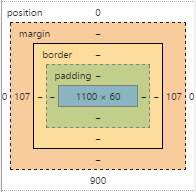

# CSS

## CSS 박스 모델

block, inline-block 속성값을 가지는 요소는 박스형태이다.

박스모델은 아래 4가지 개념으로 설명할 수 있다.

- **content : 실제 html 태그 내 컨텐츠로써 내용이 차지하는 영역**

- **padding : 테두리(border)와 컨텐츠 사이의 여백**

- **border : 박스의 테두리**

- **margin : 테두리 바깥 여백**
