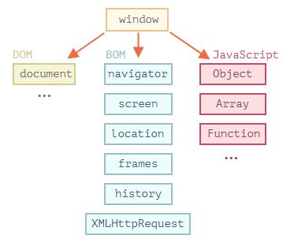
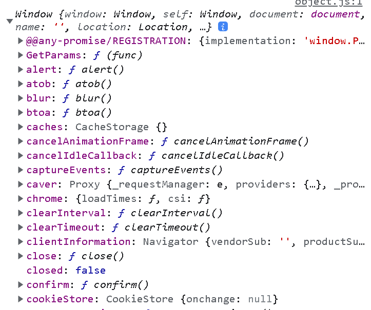

# JavaScript

## window, DOM, BOM에 대한 이해

우리는 이제 객체에 대한 개념을 알고 있다.

웹브라우저에서 자바스크립트를 사용할 때 모든 것의 최상위 객체가 바로 `window` 객체이다.

아래 그림과 같이 window 객체 안에는 다양한 속성, 메서드 그리고 DOM, BOM과 관련된 다양한 객체가 존재한다.

`document` 객체는 문서, 한마디로 HTML을 조작하기 위한 기능이 존재하는 객체이며 DOM이라고 부른다.

`BOM`(navigator, screen, location ...etc)은 브라우저를 조작하기 위한 기능이 존재하는 객체이다.



`console.log(window);` 의 결과



**간단히 살펴보는 브라우저 동작원리**

html, css 파싱 → 트리 구성 → 렌더링 트리 → 렌더링


**script 태그를 body 태그 하단에 위치시켜야하는 이유**

웹브라우저에서 자바스크립트는 HTML, CSS와는 다르게 별도의 자바스크립트 엔진이 존재한다.

만약, head 태그 내부에 script 태그를 위치시킨다면 DOM 트리를 구성하는 도중 자바스크립트 엔진으로 제어권한을 넘기게 된다.

JS 엔진은 코드 실행이 끝난 뒤에 다시 HTML, CSS 파서에게 제어 권한을 넘긴다.

브라우저는 HTML, CSS, JS 처리를 순차적으로(동기적으로) 진행하는데, script 태그 위치에 따라 충돌이 일어날 수 있다.

**간단히 살펴보는 window 객체 (alert, confirm, prompt ..)**

window 객체는 웹브라우저를 나타내는 가장 상위에 있는 루트 객체이다.

```javascript
window.alert("안녕하세요"); // alert : 알림
window.confirm("반가워요"); // confirm : 사용자의 확인
window.prompt("오늘 기분 어때요?"); // prompt : 사용자 입력받기
```

**간단히 살펴보는 DOM**

문서 객체 모델 DOM은 웹 페이지 내 모든 콘텐츠를 객체로 나타낸다.

`document` 객체는 페이지의 진입점 역할을 한다.

이 객체를 이용해 웹 페이지에서 각종 CRUD 작업을 할 수 있다.

```javascript
document.body.style.background = "red"; // 이 문서내에서 body태그 선택 -> style 속성 -> background 속성을 red로 설정
```

**간단히 살펴보는 BOM**

브라우저 객체 모델 BOM은 DOM 이외에 브라우저를 제어하는 객체이다.

1. navigator
   - 브라우저와 운영체제에 대한 정보를 제공

   ```javascript
   console.log(navigator.userAgent);
   ```

2. location
   - 현재 url을 읽고 새로운 url로 변경할 수 있음

   ```javascript
   console.log(location.href); // 현재 URL 전체
   console.log(location.pathname); // URI 부분만
   ```
