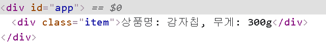

# JavaScript

## DOM API

### 태그 추가


- document.createElement() : 태그 만들기
- document.createTextNode() : text 노드 만들기
- element.appendChild() : 자식 노드 추가하기
- element.setAttribute(attribute, value) : 요소에 속성 추가하기

다음은 div.inner 태그 내부에 `<div>hello</div>`를 추가하는 예제이다.

```html
<!DOCTYPE html>
<html lang="ko">
  <head>
    <meta charset="UTF-8" />

    <title>Document</title>
  </head>
  <body>
    <div id="container">
      <div class="inner"></div>
    </div>
    <script>
      // div.inner를 선택
      let inner = document.querySelector(".inner");
      // <div>태그 생성
      let element = document.createElement("div");
      // text 노드 hello 생성
      let hello = document.createTextNode("hello");
      // <div>hello</div>로 만들기
			element.appendChild(hello);
      // div.inner에 element 추가
      inner.appendChild(element);
    </script>
  </body>
</html>
```

DOM은 JS로 HTML, CSS를 조작하기 위함이고 핵심은 역시나 CRUD 이다.

노드를 일일이 생성해서 하는 방식은 다소 번거로울 수 있다.

`ES6 템플릿 리터럴`

문자열 안에 변수, 표현식 등을 넣어서 사용할 수 있다.

백틱(\` \`)을 이용하고 표현식을 사용하기 위해서는 $과 중괄호({})를 사용한다.

```javascript
let name = "홍길동"
console.log(`안녕하세요 제 이름은 ${name}입니다.`);
```

우선 비어있는 div 태그를 하나 만들자.

```html
<div id="app"></div>
```

네트워크 요청을 통해 서버에서 상품 정보를 받아왔다고 가정하겠다.

상품 정보는 아래와 같다.

```javascript
const productsData = { title: "감자칩", weight: 300 };
```

div#app 태그에 item을 넣는 예제이다.



**중간 실습**

- 위 예제에서 productsData2가 아래와 같을 때, item으로 각각 추가하시오.

```javascript
const productsData = [
  { title: "감자칩", weight: 300 },
  { title: "칙촉", weight: 100 },
  { title: "고구마칩", weight: 300 },
  { title: "오잉", weight: 50 },
];
```