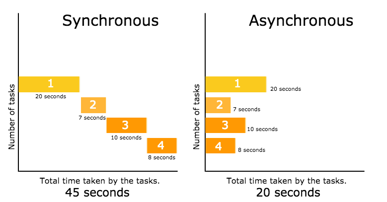

# JavaScript

## Javascript Async

### 동기/비동기 방식의 이해

- 동기(syncronous) : 코드 한 줄, 한 줄 실행이 끝난 뒤 다음 코드로 넘어가는 처리 방식

- 비동기(asyncronous) : 코드 실행 후, 완료 여부와 관계없이 다음 코드로 넘어가는 처리 방식

실행이 오래걸리는 코드라면 효율성 측면에서 비동기로 실행하는 것이 더 좋다.



**비동기 동작 예시**

```javascript
// 1
console.log('1등!');
// 2
setTimeout(function() { // setTimeout 함수 : 비동기적으로 작동함
    console.log('2등!');
}, 2000);
// 3
console.log('3등!');
```

**하지만,**

비동기 방식으로 인해 문제가 발생할 수 있다.

네트워크 요청(API) 역시 비동기적으로 이루어진다.

요청 결과 여부에 상관없이 다른 코드를 실행할 수 있다는 것은 효율성 측면에선 큰 장점이지만,

API 요청으로 반환된 값을 반드시 활용해야하는 경우라면 `코드의 실행 순서를 보장받아야`만 한다.

우리는 이를 비동기 처리라고 부를 것이며, 자바스크립트에서 제공하는 주요 3가지 방식은 아래와 같다.

### JS 비동기 처리

- 콜백함수
- promise 객체
- async, await

**콜백함수**

```javascript
function first(next) {
  setTimeout(() => {
    console.log("first");
    next();
  }, 2000);
}

function second() {
  console.log("second");
}

first(second);
```

**`콜백함수의 약점.. 콜백지옥`**

연속되는 비동기 처리를 위해 콜백함수를 여러 번 사용할 때 문제가 발생함.

콜백 함수끼리 꼬리를 무는 형태가 되고 이런 코드는 가독성이 떨어지고 유지보수가 어려워진다.

이것을 콜백지옥이라고 부른다.

```javascript
function hell() {
  setTimeout(
    (name) => {
      let checkList = name;
      console.log(checkList);

      setTimeout(
        (name) => {
          checkList += ", " + name;
          console.log(checkList);

          setTimeout(
            (name) => {
              checkList += ", " + name;
              console.log(checkList);

              setTimeout(
                (name) => {
                  checkList += ", " + name;
                  console.log(checkList);
                },
                500,
                "four"
              );

            },
            500,
            "three"
          );

        },
        500,
        "two"
      );
    },

    500,
    "one"
  );
}

hell();
```

`일반 기명함수로 콜백지옥 개선하기`

기명함수를 사용하면 복잡한 들여쓰기는 피할 수 있지만,

콜백함수를 계속해서 봐야하고 로직을 파악하는데 소요되는 비용은 여전히 만만치 않음.

이는 promise또는 async 방식을 이용하면 개선할 수 있습니다.

```javascript
function hell() {
  setTimeout(
    (name) => {
      let checkList = name;
      console.log(checkList);
      hellTwo(checkList);
    },
    500,
    "one"
  );
}

function hellTwo(checkList) {
  setTimeout(
    (name) => {
      checkList += ", " + name;
      console.log(checkList);
      hellThree(checkList);
    },
    500,
    "two"
  );
}

function hellThree(checkList) {
  setTimeout(
    (name) => {
      checkList += ", " + name;
      console.log(checkList);
      hellFour(checkList);
    },
    500,
    "three"
  );
}

function hellFour(checkList) {
  setTimeout(
    (name) => {
      checkList += ", " + name;
      console.log(checkList);
    },
    500,
    "four"
  );
}

hell();
```