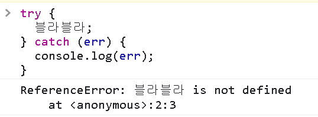

# JavaScript

## Javascript Async

### 동기/비동기 방식의 이해

**async, await**

`기본 사용법`

```javascript
async fuction 함수명() {
    await 비동기처리함수();
}
```

async, await를 사용한 비동기처리는 무엇보다 사람이 읽기 쉽다는 장점이 있다.

**콜백함수, Promise, async 한 눈에 비교하기**

각 기술을 사용해서 동일하게 순서대로 1, (0.5초 대기), 2, 3을 콘솔에 찍는 코드이다.

`콜백함수`

```javascript
function example1(callback) {
    console.log(1);
    callback();
}

function getCallback() {
    setTimeout(() => {
        console.log(2);
        console.log(3);
    }, 500);
}

example1(getCallback);
```

`Promise`

```javascript
function example() {
    console.log(1);
    getPromise().then((res) => {
        console.log(res);
        console.log(3);
    });
}

function getPromise() {
    return new Promise((resolve, reject) => {
        setTimeout(() => {
            resolve(2);
        }, 500);
    });
}

example();
```

**async, await**

이것을 사용하는 것도 역시 Promise를 활용하는 것이다.

promise에서 resolve로 넘어온 값이 await 구문에 반환되는 것이라고 이해하면 된다.

```javascript
async function asyncFunction() {
    console.log(1);
    const result = await getResult();
    console.log(result);
    console.log(3);
}

function getResult() {
    return new Promise((resolve, reject) => {
        setTimeout(() => {
            resolve(2);
        }, 500);
    });
}

asyncFunction();
```

HTTP 통신으로 API 요청하는 것을 배우지 않았기 때문에 활용이 와닿지 않을 수 있지만,

서버에 대해 공부하면서 클라이언트 - 서버 통신간에 비동기 처리 기법이 빛을 발하게 될 것이다.

`aync, await와 try-catch 문법`

async/await 구문에서 에러처리를 위해서는 먼저 try-catch 문법을 이해해야 한다.

```javascript
try {
  블라블라;
} catch (err) {
  console.log(err);
}
```



try-catch문은 try 블록에서 만약 에러가 발생한다면 catch 블록으로 에러를 던지고, 처리할 수 있다.

aync/await 구문에서는 이렇게 try-catch문을 이용해서 에러를 처리할 수 있다.

try-catch를 이용하면 비동기 처리 이외에도 일반적인 에러까지도 잡아낼 수 있는 장점이 있다.

```javascript
async function asyncFunction() {
    try {
        console.log(1);
        const result = await getResult();
        console.log(result);
        console.log(3);
    } catch (err) {
        console.log(err);
    }
}

function getResult() {
    return new Promise((resolve, reject) => {
        setTimeout(() => {
            reject(new Error("에러발생 예시"));
        }, 500);
    });
}

asyncFunction();
```