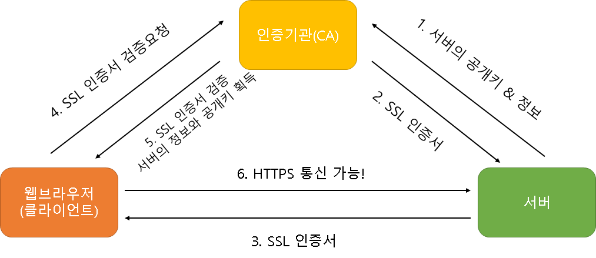

# 서버 구축

## 구글 클라우드 플랫폼 (Google Cloud Platform)

[구글 클라우드 플랫폼 (Google Cloud Platform)](https://cloud.google.com/)

## 웹서버, 백엔드, 데이터베이스 설치하기

```bash
sudo su // 관리자 권한

apt-get update // 패키지 관리자 업데이트

apt-get install nginx // nginx 설치

apt-get install nodejs // nodejs 설치

apt-get install mysql-server // mysql 설치
```

## HTTPS

### HTTPS의 이해

현재 우리가 nginx를 설치한 ip로 접속하면 HTTP 통신을 하기 때문에 크롬에서 `안전하지 않음` 이라고 표시한다.

클라이언트-서버 통신간에 암호화를 통해 안전하게 통신해야할 필요가 있다.

그래서 HTTP에서 Secure가 추가된 HTTPS를 사용한다.

HTTP에서는 암호화 하지 않은 데이터를 주고 받는다.

중간에 해커가 이를 탈취해서 보면 그대로 볼 수 있는 구조이다.

이런 단점을 개선하고자 HTTPS는 데이터를 암호화하여 통신한다.


데이터를 암호화하고 복호화하기 위해서는 암호문이 필요하다.

이것을 key라고 한다.

**key**

- 대칭키: 클라이언트 & 서버가 서로 같은 키를 가지고 암호화 및 복호화를 할 수 있는 키
- 비대칭키: 클라이언트(공개키) & 서버(개인키)가 서로 다른 키
    - 개인키: 키 발행자만 가지는 키. 일반적으로 서버에서 개인키를 가지고 있다.
        - 개인키로 암호화되거나, 복호한 키는 오로지 공개키로 복호화하고, 암호화할 수 있다.
    - 공개키: 개인키와 한 쌍이 되어 일반적으로 클라이언트가 가지고 있다.
        - 공개키로 암호화되거나, 복호한 키는 오로지 개인키로 복호화하고, 암호화할 수 있다.



1. 서버는 한쌍의 공개키와 개인키를 생성한다.
공개키는 CA에 전송하여 SSL 인증서 발급을 요청한다.

2. CA는 서버로부터 공개키를 받고 SSL인증서를 발급한다. 이때 SSL인증서에 대해 CA는 개인키, 공개키를 발급한다. 이를통해 SSL 인증서는 오로지 CA를 통해 검증 받을 수 있다.

3. 클라이언트는 서버로부터 SSL인증서를 받고 CA에게 검증을 요청한다.
검증이 완료되면 서버의 공개키를 얻을 수 있다.
클라이언트는 이 공개키로 클라이언트의 `대칭키`를 암호화 하여 서버에게 전송한다.

4. 서버는 클라이언트로부터 받은 데이터를 개인키로 복호화하여 클라이언트의 `대칭키`를 획득한다.

5. 이제 클라이언트와 서버는 같은 대칭키를 가지고 있고 안전하게 통신할 수 있다.

### HTTPS 적용

1. 도메인 발급 및 적용
2. Let's Encrypt(CA) SSL 인증서 발급
3. HTTPS 통신

**0단계**
- 방화벽에서 HTTPS(443) 포트가 열려 있어야 함.**

**1단계: Certbot 설치**

```bash
sudo apt update

sudo apt install certbot python3-certbot-nginx -y
```

**2단계: Nginx 설정 파일 수정**

```bash
sudo nano /etc/nginx/sites-available/default
```

파일 중간의 server_name 부분을 찾아 본인의 도메인으로 수정

저장(Ctrl+O, Enter) 후 종료(Ctrl+X)하고 설정을 적용.

```bash
sudo nginx -t // 명령어 잘 입력했는지 확인

sudo systemctl reload nginx
```

**3단계: SSL 인증서 발급 (Certbot 실행)**

```bash
sudo certbot --nginx -d 여러분의도메인.com
```

**4단계: 인증서 자동 갱신 확인**

Let's Encrypt 인증서는 90일 동안만 유효함.

congratulations라는 문구가 보인다면 성공

```bash
sudo certbot renew --dry-run
```

**5단계: 결과 확인 및 보안 체크**

[SSL LABS 테스트](https://www.ssllabs.com/index.html)